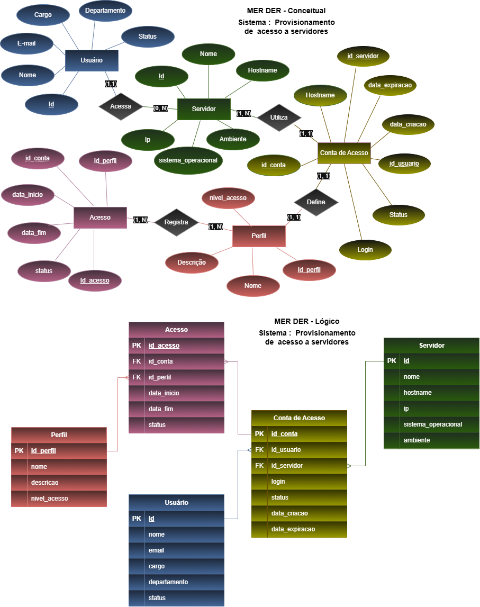

# Projeto: Provisionamento de acessos a servidores



## Dicionário de Dados

| Entidade | Atributo | Tipo | Tamanho| Descrição |
|-|-|-|-|-|
| Usuário | id | int | 11 | Identificador, PK, Auto incrementável |
| Usuário | nome | varchar | 100 | Nome do usuário |
| Usuário | email | varchar | 20 | E-mail do usuário |
| Usuário | cargo | varchar | 50 | Cargo do usuário |
| Usuário | departamento | varchar | 100 | Departamento do usuário |
| Usuário | status | varchar | 100 | Status do usuário |
| Servidor | id | int | 11 | Identificador, PK, Auto incrementável |
| Servidor | nome | varchar | 100 | Nome do servidor |
| Servidor | hostname | varchar | 20 | Nome do host do servidor |
| Servidor | ip | string | 20 | IP do servidor |
| Servidor | sistema_operacinal | varchar | 50 | Sistema Operacional do servidor |
| Servidor | ambiente | varchar | 40 | Area em que o servidor é utilizado |
| Conta de Acesso | id_conta | int | 11 | Identificador, PK, Auto incrementável |
| Conta de Acesso | id_usuario | int | 11 | Identificador do usuário, FK referenciando Usuário (id)|
| Conta de Acesso | id_servidor | int | 11 | Identificador do servidor, FK referenciando Servidor (id)|
| Conta de Acesso | login | varchar | 50 | Login da conta de acesso |
| Conta de Acesso | status | varchar | 20 | Status da conta de acesso |
| Conta de Acesso | data_criacao | Date |  | Data de criação da conta de acesso |
| Conta de Acesso | data_expiracao | Date |  | Data de expiração da conta de acesso |
| Perfil | id_perfil | int | 11 | Identificador, PK, Auto incrementável |
| Perfil | nome | varchar | 100 | Nome do perfil |
| Perfil | descricao | varchar | 200 | Descrição do perfil |
| Perfil | nivel acesso | int | 11 | Nivel de acesso |
| Acesso | id_acesso | int | 11 | Identificador, PK, Auto incrementável |
| Acesso | id_conta | int | 11 | Identificador da conta, FK referenciando Conta de Acesso (id)|
| Acesso | id_perfil | int | 11 | Identificador do perfil, FK referenciando Perfil (id)|
| Acesso | data_inicio | date |  | Data de criação da autorização de acesso|
| Acesso | data_fim | date |  | Data de expiração da autorização de acesso|
| Acesso | status | varchar | 20 | Status da autorização de acesso |

## Dados de teste em CSV

## Script SQL DDL (Desenvolvimanto: Criação do Banco de dados)
```sql
drop database if exists provisionamentos;
create database provisionamentos;
use provisionamentos;
create table usuario(
    id int not null primary key auto_increment,
    nome varchar(100) not null,
    email varchar(20) not null,
    cargo varchar(50) not null,
    departamento varchar(100) not null,
    status varchar(100) not null
);
create table servidor(
    id int not null primary key auto_increment,
    id_cliente int not null,
    numero varchar(100) not null unique,
    tipo enum('Residencial', 'Comercial', 'Celular') not null
);
create table conta_acesso(
    id int not null primary key auto_increment,
    nome varchar(100) not null,
    cep varchar(11) not null,
    numero varchar(10),
    complemento varchar(100)
);
create table pedido(
    id int not null primary key auto_increment,
    id_cliente int not null,
    id_produto int not null,
    quantidade int not null,
    valor_unitario decimal(10,2) not null,
    subtotal decimal(10,2) default (valor_unitario * quantidade)
);

alter table telefone add constraint fk_telefones foreign key (id_cliente) references cliente(id);
alter table pedido add constraint fk_faz foreign key (id_cliente) references cliente(id);
alter table pedido add constraint fk_possui foreign key (id_produto) references produto(id);

describe produto;
describe telefone;
describe cliente;
describe pedido;
show tables;
```
